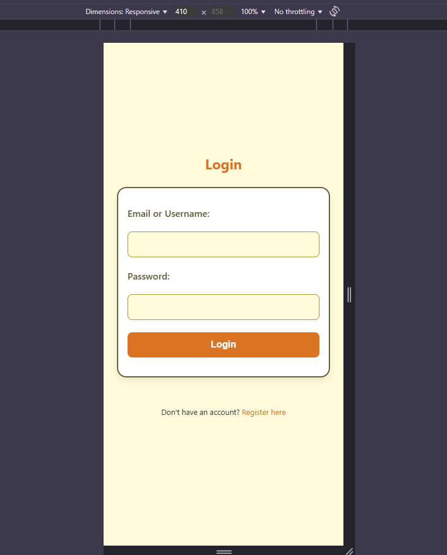
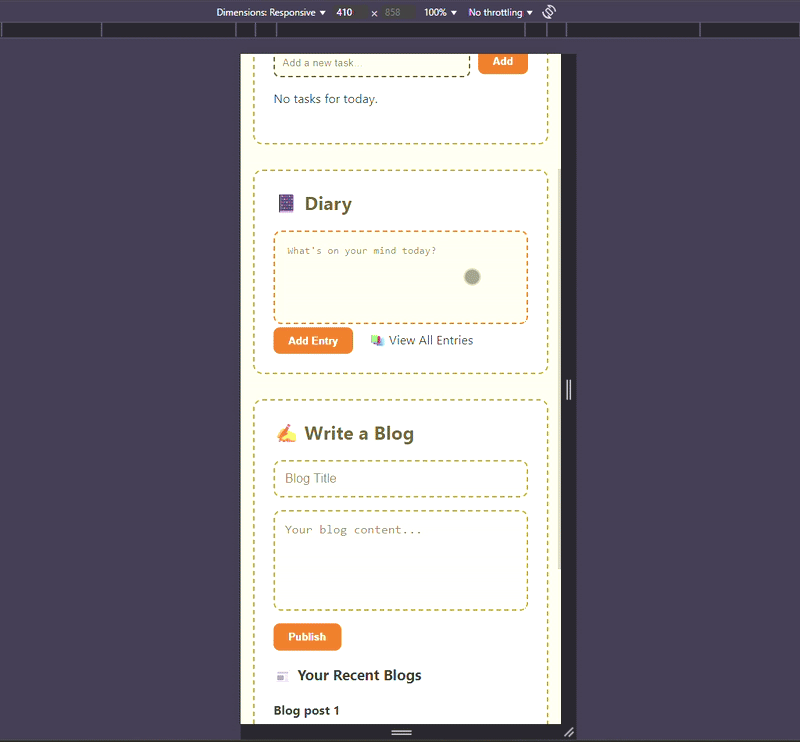
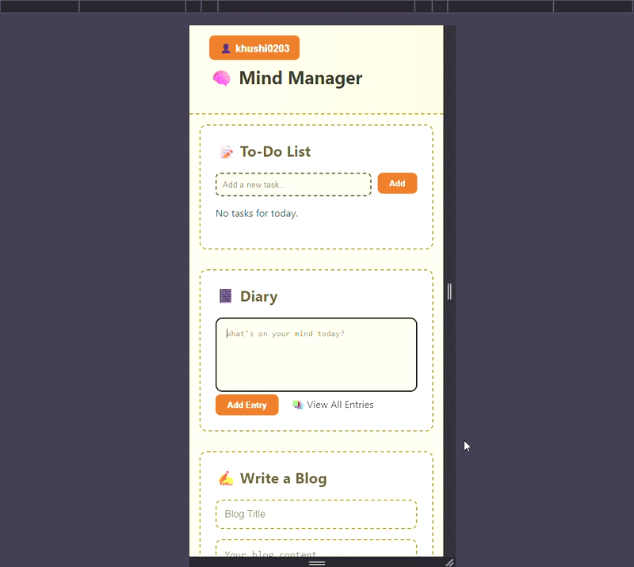
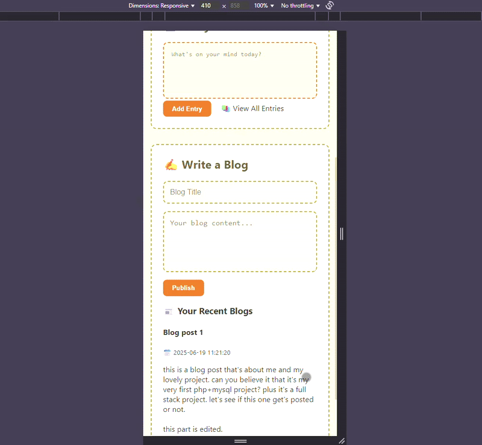

<h1>🧠 Mind Manager App — Productivity Mobile App</h1>

  A modular web-based productivity app built using <strong>PHP</strong> as the core backend language with integrated <strong>HTML</strong> for structure and templating, and <strong>MySQL</strong> for database management. It also uses <strong>CSS</strong> and <strong>JavaScript</strong> for styling and interaction. The project also features <strong>user authentication</strong> including login and signup functionality. This app lets users write daily diary entries, maintain blogs, and potentially track to-dos or thoughts—all under one interface.

<h2>⚙️ Feature Highlights</h2>

<ul>
  <li><strong>🔐 Auth:</strong> Basic login/signup structure using PHP 
    
<strong>Login Page</strong>

    
  </li>
  <li><strong>📂 Entry Overview:</strong> View all previous diary entries in one click from the dashboard</li>
  <li><strong>📰 Blog Preview:</strong> Dashboard shows your latest blogs with an option to view full blog 
    
<strong>Dashboard View</strong>

    
  </li>
  <li><strong>🧾 To-Do List:</strong> Add tasks, tick them when done, and delete them later 
    
<strong>Task Manager</strong>

    
  </li>
  <li><strong>📝 Diary:</strong> Write & save personal notes or journal entries 
    
<strong>Diary Section</strong>

    
  </li>
  <li><strong>📚 Blog:</strong> Add, display, and manage blogs</li>
  <li><strong>✏️ Blog Editor:</strong> From the full blog view, you can also edit or delete your post 
    
<strong>Blog Preview and Edit</strong>

    
  </li>
</ul>

<h2>🧠 What I Practiced</h2>
<ul>
  <li>Creating a modular dashboard layout using includes</li>
  <li>Organizing static assets for reusability</li>
  <li>Building an authentication system using PHP</li>
  <li>Writing clean, maintainable file structures</li>
  <li>Planning for database integration and content expansion</li>
</ul>

<h2>📁 Folder & File Structure</h2>

<table>
  <thead>
    <tr>
      <th>File/Folder</th>
      <th>Purpose</th>
    </tr>
  </thead>
  <tbody>
    <tr>
      <td><code>index.php</code></td>
      <td>Landing/dashboard page for the app</td>
    </tr>
    <tr>
      <td><code>assets/css</code></td>
      <td>Custom stylesheets</td>
    </tr>
    <tr>
      <td><code>assets/js</code></td>
      <td>JS files for UI interaction</td>
    </tr>
    <tr>
      <td><code>assets/images</code></td>
      <td>All icons/images used in UI</td>
    </tr>
    <tr>
      <td><code>auth/</code></td>
      <td>Authentication logic (login/signup/logout)</td>
    </tr>
    <tr>
      <td><code>blogs/</code></td>
      <td>Handles blog writing and display</td>
    </tr>
    <tr>
      <td><code>diary/</code></td>
      <td>Handles daily journal/notes</td>
    </tr>
    <tr>
      <td><code>includes/</code></td>
      <td>Reusable PHP components (header, footer, db config)</td>
    </tr>
  </tbody>
</table>

<h2>🛠️ Technologies Used</h2>
<ul>
  <li>HTML5 + CSS3</li>
  <li>Vanilla JavaScript</li>
  <li>PHP (Modular includes + routing)</li>
  <li>MySQL (Planned database integration)</li>
</ul>

<h2>📌 Future Plans</h2>
<ul>
  <li>Dynamic CRUD for blogs and diary</li>
  <li>Theme customization (dark mode, fonts)</li>
  <li>To-Do section with daily reminders</li>
  <li>User-selected themes (light, dark, high-contrast, etc.)</li>
  <li>Font size and style adjustments for accessibility</li>
  <li>Privacy settings and optional content filters</li>
</ul>

<h2>🙇‍♀️ About Me</h2>

  I created this project to practice organizing a real-world multi-feature layout using PHP and frontend principles. It's a playground for my experiments in full-stack logic, responsive design, and user interactivity.

  Built with ❤️ by <a href="https://github.com/ks-fsdev" target="_blank">Khushi Srivastava</a>

